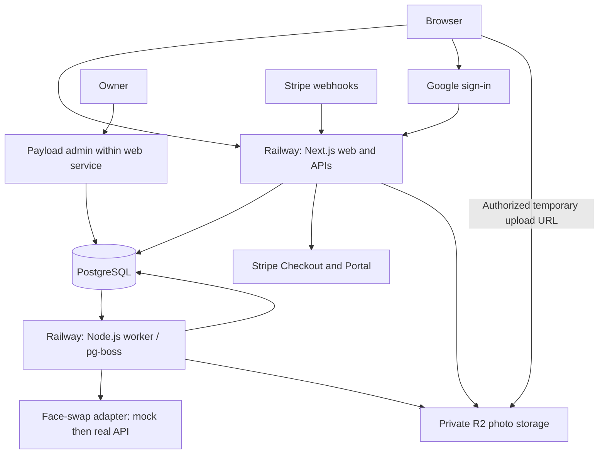

# Face-swap SaaS — architecture and implementation plan

Prepared: 16 September 2026. Updated: 26 September 2026.

Status: local application implemented and tested; production integrations and remaining operations work are pending. See [docs/VERIFICATION.md](docs/VERIFICATION.md) for verified behavior and explicit gaps. Phase checkboxes below describe full acceptance criteria, including external-service validation; they are not all complete.

Implemented: responsive studio, Google auth integration, guest trials, private storage, durable mock jobs, Stripe checkout/webhook/accounting integration, account/history pages, Payload blog editor, and owner credit dashboard. Real face swaps remain deferred until the provider is supplied.

## 1. Confirmed product requirements

- Single-face photo swapping: upload a source face photo and a target person photo.
- One free swap before registration; further swaps require a Google account and subscription.
- Stripe weekly, monthly, and yearly subscriptions, plus extra credit purchases.
- Saved photo/results history.
- A headless blog CMS with an editor, managed by one owner.
- An admin dashboard for users, subscriptions, credits, jobs, and content.
- Railway application hosting and a custom domain.
- Prefer free/open-source software and free service tiers where practical.
- Integrate the actual face-swap API in the final implementation stage.
- No additional product-specific content restrictions requested. Provider-enforced rejection responses still need to be handled as failed jobs.

## 2. Proposed defaults and open decisions

These defaults make implementation concrete; they are proposals, not additional confirmed requirements.

| Item | Proposed default |
| --- | --- |
| Free trial | One successful guest swap; signing in does not issue another free swap |
| Swap price | One credit per successful photo swap |
| Paid access | An active paid subscription and an available credit are both required |
| Extra credit packs | Subscribers can purchase packs; purchased credits remain on the account after cancellation but require an active subscription to use |
| Subscription credits | Grant on each paid billing period; expire at that period's end; no rollover |
| Annual subscription | Full annual allowance granted after the annual invoice is paid; configurable allowance, not a monthly refill |
| Credit spending | Spend the earliest-expiring subscription credits before purchased credits |
| Failed swap | Release its reserved credit or trial reservation |
| Cancellation | Access continues to the paid period end; existing photo history remains accessible |
| Payment failure | Block new paid swaps until payment recovers; retain account/history access |
| Plan changes | Initially handled through cancellation/end-of-period changes; no instant prorated switching |
| Uploaded originals | Delete 24 hours after the job becomes terminal |
| Saved account results | Keep 30 days; show expiry and allow immediate deletion |
| Guest files | Keep at most 24 hours, unless securely claimed by a signed-in account |
| Upload limits | JPEG, PNG, WebP; initially 10 MB and 25 megapixels per image; revise for provider limits |
| Visual output | Full downloadable result; no watermark by default |

The owner has confirmed that the Stripe business country, prices, and credit allowances are not decided yet. Keep them configurable and use clearly labeled test values during development.

Still needed before live billing: business country/Stripe account availability, currency, subscription prices, included credit counts, and pack prices. Before launch: confirm retention defaults, annual credit allocation, and purchased-credit access after cancellation. Brand and domain can remain placeholders during development.

## 3. Stack

| Layer | Selection | Reason |
| --- | --- | --- |
| Application | Next.js App Router, TypeScript, Node.js runtime | Public pages, dashboard, server APIs, and Payload in one deployable application |
| UI | Custom CSS and reusable React components | Responsive uploads, comparison view, history, and forms |
| Customer authentication | Better Auth with Google OAuth | Application-owned sessions and account data; Google registration and login use the same flow |
| Application database | PostgreSQL with versioned SQL migrations; Drizzle for authentication | Transactional credit accounting and portable relational data |
| Initial database host | Neon free tier | Start without a separate database hosting charge, subject to quotas |
| Blog CMS | Self-hosted Payload with its PostgreSQL adapter and Lexical editor | Structured content, drafts, media, and owner administration |
| Job queue | pg-boss on PostgreSQL | Durable background work without a separate Redis service |
| Images | Private Cloudflare R2 bucket | S3-compatible object storage with a free allowance |
| Billing | Stripe Checkout, Billing, and Customer Portal | Subscriptions, one-time packs, and payment-method management |
| Runtime hosting | Railway web service and worker service | Deploy the same repository as separate web and background processes |

Use supported, mutually compatible stable versions at implementation time and commit a lockfile. Do not choose versions independently without checking Payload/Next.js and authentication compatibility.

The selections above are architectural recommendations based on the supported integrations: [Payload PostgreSQL](https://payloadcms.com/docs/database/postgres), [Payload editor](https://payloadcms.com/docs/rich-text/overview), [Better Auth Google](https://better-auth.com/docs/authentication/google), [Better Auth Drizzle](https://better-auth.com/docs/adapters/drizzle), and [pg-boss](https://github.com/timgit/pg-boss).

### Cost expectations

Free software does not make the production service entirely free. Railway web/worker compute, the face-swap API, Stripe fees, and the domain are expected costs. Neon and R2 are free only within their current allowances; monitor usage and configure budget alerts where available. Do not promise permanent free production capacity. See [Railway plans](https://docs.railway.com/pricing/plans), [Neon pricing](https://neon.com/pricing), and [R2 pricing](https://developers.cloudflare.com/r2/pricing/).

Queue polling and cleanup tasks can keep a serverless database active. Measure idle and active database use early; reduce unnecessary polling and bound connection pools. If quotas become restrictive, move the standard PostgreSQL database to a paid Neon plan or Railway PostgreSQL. Railway PostgreSQL is an alternative hosting cost, not a free database service.

## 4. System layout



The web process validates requests, checks ownership/access, reserves credits, and queues work. The worker processes images and talks to the face-swap provider. Swaps must survive a web restart and must not run inside a long HTTP request.

Use one PostgreSQL database with separate schemas and migration owners: `app` for SaaS/authentication, `cms` for Payload, and `pgboss` for the queue. Verify custom-schema support against selected versions during scaffolding; use a separate CMS database if required. Never allow either migration tool to rewrite the other's tables.

Customer sessions belong to Better Auth. Owner login belongs to a separate, invite-only Payload admin collection with public registration disabled. Customer Google login never grants CMS access. Custom Payload admin views call shared server-side business services with owner authorization; they do not edit balances or Stripe subscriptions directly.

## 5. Customer journey

### Guest trial

1. Create a random server-issued guest identity in a secure, HTTP-only cookie.
2. Present source-face and target-photo inputs with previews and upload validation.
3. Atomically reserve the guest's one trial and create a swap job; concurrent submissions cannot claim it twice.
4. Display queued/processing state and poll an ownership-protected status endpoint with backoff.
5. On successful output storage, mark the trial consumed and show comparison/download actions.
6. On the next attempt, ask the visitor to sign in with Google and choose a subscription.
7. After sign-in, atomically claim the current guest history using the guest cookie. Do not trust a client-supplied guest ID. Do not reset the trial.

Anonymous trials cannot reliably enforce one swap per human. Cookie resets and different devices can bypass them. Use persistent browser identity, short-lived rate-limit signals, concurrency caps, and a global trial spending cap; do not treat a shared IP address as proof of identity. A challenge can be added if abuse warrants it.

### Subscriber

Sign in → choose plan → Stripe Checkout → verified paid event → credits available → upload → reserve one credit → process → persist result → consume reservation → history/download.

Users can view balance, expiring credits, purchase packs, manage billing, delete photos, and request account deletion. No-balance states show purchase options before a new upload is started.

## 6. Core data model

| Entity | Main purpose and constraints |
| --- | --- |
| Auth user/account/session/verification | Better Auth-managed identity records; stable user IDs |
| Customer profile | Stripe customer ID (unique), suspension state, deletion state |
| Guest session | Hashed token, trial state, expiry, optional claimed user |
| Plan version | Internal code, server-owned Stripe price ID, interval, currency, credit grant; immutable terms for existing purchases |
| Subscription | Unique Stripe subscription ID, user, price/version, status, paid-through date, period boundaries, cancellation state |
| Credit grant | Subscription invoice, pack payment, or owner adjustment; original amount, expiry, remaining/reserved amounts |
| Credit ledger | Append-only grant/reserve/consume/release/expire/reverse entries, reason, actor, job/payment reference, unique idempotency key |
| Credit reservation | Job-to-grant allocation; one active reservation per job; enforce consistent totals |
| Asset | Owner or guest, source/target/result kind, object key, content type, dimensions, byte count, retention/deletion status |
| Swap job | Owner, assets, state, request key, reservation, provider request ID, attempt count, timestamps, error code |
| Outbox event | Durable dispatch intent created in the same transaction as job/payment changes |
| Stripe event inbox | Unique Stripe event ID, payload reference/minimal payload, processing state, retry information |
| Admin audit | Actor, action, target, reason, before/after metadata; avoid image URLs and secrets |
| Blog data | Payload-owned posts, categories, public media, authors, redirects, and site settings |

Use foreign keys, unique constraints, and database transactions. Never implement credits as an unprotected read-then-write integer. Financial records and retained account identifiers require a separate deletion policy from disposable photos.

## 7. Credit and billing rules

- Accept only server-configured Stripe price IDs. Never trust client-submitted amounts or credit quantities.
- Store customer/user mapping on the server; verify ownership for Checkout and Portal creation.
- Activate subscription benefits only after a verified successful paid invoice, including zero-total paid invoices if deliberately configured.
- Grant subscription credits once per invoice entitlement period; exclude proration/non-entitlement invoices. Enforce a unique business key, not only webhook event-ID deduplication.
- Grant packs only after confirmed payment, including delayed payment success events; a redirect or a merely completed unpaid checkout cannot grant credits.
- Validate webhook signatures using the raw request body, durably record the event, then process asynchronously. Duplicate or out-of-order delivery must be safe.
- Reconcile subscription status with Stripe and avoid applying stale events over newer state. Periodically reconcile missed events.
- On swap submission, lock eligible grants and reserve atomically. Commit the job and outbox dispatch together. Dispatch retries cannot create another billable job.
- On success, persist and validate the result before consuming the reservation. Terminal failure releases it exactly once.
- A valid reservation survives grant expiry while its job is in flight; released expired credits do not become spendable again.
- Refunds/disputes reverse corresponding unspent grants and suspend affected entitlements as appropriate. Record already-spent shortfalls for owner review; preserve ledger history.
- Credit adjustments require owner authorization, a reason, and a compensating ledger entry. No direct balance editing.

Stripe supports week, month, and year recurring intervals. Delivery/retry/signature behavior must follow [Stripe subscription documentation](https://docs.stripe.com/api/subscriptions/object) and [Stripe webhook documentation](https://docs.stripe.com/webhooks). Live account eligibility depends on the business's registered country: [Stripe availability](https://stripe.com/global).

## 8. Images, jobs, and provider boundary

### Upload and access

- Issue short-lived signed upload URLs only for server-generated keys associated with the current guest/customer.
- Upload into a staging prefix. Validate actual bytes, dimensions, format, and size server-side; decode and re-encode accepted images, normalize orientation, and remove unnecessary metadata.
- Copy validated content to an immutable processing key so a still-valid upload URL cannot replace a job's input.
- Keep customer images private. Use short-lived signed downloads after ownership checks and private/no-store responses for user-specific routes.
- Keep public blog media in a separate bucket or independently scoped namespace; CMS uploads never expose private customer objects.
- Clean up orphaned uploads, expired results, deleted accounts' images, and abandoned guest assets through retryable worker tasks.
- Explicit deletion hides assets immediately and schedules object removal. In-flight jobs for deleted assets/accounts must not recreate visible files; clean up any late provider result.

### Job lifecycle

`queued → validating → processing → saving → succeeded`

Alternative states: `retry_wait`, `reconciling`, `failed`, `canceled`. Every terminal transition is idempotent and resolves its reservation.

Use bounded concurrency, provider timeouts, rate-limit backoff, worker heartbeats, and stale-job recovery. Transport ambiguity after provider submission requires reconciliation, not blind resubmission: persist provider IDs and send an idempotency key if supported. Queue delivery guarantees cannot prevent an external provider from charging twice by themselves.

If provider success is followed by an R2 write failure, retry retrieving/storing that result before resubmitting generation. Do not release a reservation while an unknown provider request could still complete; resolve it through reconciliation or an explicit owner decision.

### Adapter contract

Expose `submitSwap`, `getSwapStatus`, and optional `cancelSwap`; normalize synchronous responses into the same job model. Inputs use validated internal asset references. The adapter supplies temporary URLs or bytes according to provider requirements. Credentials remain server-side.

The mock adapter returns clearly labeled fixture output and simulates success, rejection, timeout, and delayed completion. Never present fixture copying as real face swapping. Mock mode is development/staging only; production startup must reject it.

Final integration must establish provider limits, sync/async behavior, authentication, single-face detection/selection rules, result URL lifetime, data retention, timeout behavior, idempotency, and error mapping. No-face or multiple-face inputs must have a defined rejection path. Until then, final image dimensions and latency targets remain provisional.

## 9. CMS, admin, and routes

### Blog CMS

Posts need title, slug, summary, rich text, cover image/alt text, category, author, draft/published state, publication date, SEO title/description, canonical URL, and social preview. Provide preview, revisions, scheduling, sitemap inclusion, and redirects after slug changes. Scheduled publishing needs an explicitly configured worker task.

Only published, due content is publicly accessible. Draft preview requires owner authentication or a scoped expiring token. Revalidate public blog caches when publication changes. Restrict public CMS API access to the required published fields.

### Owner dashboard

- Overview: signups, successful/failed swaps, trial conversions, credits issued/spent, queue state, and storage usage.
- Users: search, subscription/credit history, suspend/restore, and audited adjustments.
- Jobs: inspect failure codes, reconcile uncertain submissions, retry eligible failed work safely.
- Billing: subscription/payment references and links to Stripe; financial actions stay in Stripe initially.
- Content: blog editing, media, categories, and site settings.
- Settings: public plan display and versioned entitlement configuration; secrets remain environment variables.

### Pages and API outline

| Surface | Routes |
| --- | --- |
| Public | `/`, `/face-swap`, `/pricing`, `/blog`, `/blog/[slug]`, `/privacy`, `/terms` |
| Account | `/login`, `/dashboard`, `/dashboard/history`, `/dashboard/billing`, `/dashboard/settings` |
| Owner | `/admin` with Payload content and custom SaaS views |
| Authentication | `/api/auth/*` |
| Uploads/jobs | `POST /api/uploads`, `POST /api/uploads/:id/complete`, `POST /api/swaps`, `GET /api/swaps/:id` |
| Assets | `GET /api/assets/:id/download`, `DELETE /api/assets/:id` |
| Billing | `POST /api/billing/checkout`, `POST /api/billing/credits`, `POST /api/billing/portal`, `POST /api/webhooks/stripe` |
| Account lifecycle | `POST /api/account/deletion` |
| Operations | `/api/health/live`, `/api/health/ready`; owner-only metrics |

All resource endpoints enforce ownership server-side. Cookie-authenticated mutations need origin/CSRF protection. Apply per-user/guest upload and job limits, request validation, and safe errors. Do not log photos, OAuth tokens, signed URLs, or full payment payloads unnecessarily.

## 10. Repository and deployment

```text
src/
  app/                    # Public/account routes, HTTP APIs, Payload route group
  components/             # Uploads, before/after comparison, billing/history UI
  server/
    auth/                 # Better Auth and owner authorization helpers
    db/                   # App schema and transactional repositories
    billing/              # Stripe, reconciliation, credit ledger
    swaps/                # Job lifecycle and provider adapters
    storage/              # Signed access, validation, retention
    services/             # Shared customer/admin business operations
  cms/                    # Payload collections, access rules, custom views
  worker/                 # pg-boss, outbox dispatch, reconciliation, cleanup
migrations/app/
migrations/cms/
tests/
payload.config.ts
Dockerfile
.env.example
```

Railway runs a web service and an independently restartable worker from the same image. Use separate start commands, health/readiness checks, graceful shutdown, bounded database pools, and one migration release step. PostgreSQL and R2 hold durable data; container disk is temporary.

Environment configuration includes app URL, database URLs, authentication secret, Google OAuth credentials, Payload secret, R2 credentials/bucket/endpoint, Stripe secret/webhook secret and price mappings, worker limits, retention settings, and eventually provider credentials. Commit only placeholders. Separate test/live Stripe configuration and staging/production storage.

Configure custom-domain HTTPS and exact Google redirect URLs. Run migrations once per release with a locking strategy. Test database backup restoration and document recovery; verify what the chosen free database tier provides and arrange encrypted exports if needed. Object retention/deletion must also cover backups according to a documented schedule.

## 11. Implementation phases and acceptance criteria

### Phase 1 — foundation

- [ ] Scaffold Node.js/TypeScript application, reusable UI, environment validation, and local PostgreSQL.
- [ ] Establish migration ownership and compatible dependency versions.
- [ ] Deploy web and worker skeletons to Railway; connect database and health checks.
- [ ] Measure idle queue/database usage before committing to the free-tier operating model.
- Acceptance: reproducible local setup and healthy deployment with persistent database state.

### Phase 2 — identity, storage, and mock swap journey

- [ ] Google login/logout, guest identity, trial claim, protected dashboard, and separate owner login.
- [ ] Private uploads, validation/re-encoding, download/delete authorization, and history.
- [ ] Durable jobs, reservations, outbox, lifecycle recovery, and mock adapter.
- [ ] Responsive upload, progress, errors, result comparison, and download UX.
- Acceptance: one successful guest trial; concurrent attempts blocked; sign-in preserves history; fixture results clearly marked; failures release reservations.

### Phase 3 — subscriptions and credits

- [ ] Stripe test-mode weekly/monthly/yearly subscriptions, packs, and Portal.
- [ ] Credit grants/ledger, expiry, reservations, paid-access gate, and plan configuration.
- [ ] Verified webhook inbox, idempotent handlers, reconciliation, refunds/disputes.
- Acceptance: duplicate/out-of-order events never duplicate grants; simultaneous jobs cannot overspend; payment failures/cancellation obey access rules.

### Phase 4 — blog and owner operations

- [ ] Payload editor, media, SEO fields, preview, revisions, publication scheduling.
- [ ] Public blog rendering, sitemap, redirects, and cache invalidation.
- [ ] Owner views for users, credits, jobs, settings, and audit records.
- Acceptance: owner can publish and manage the SaaS; customers cannot reach owner operations or draft content.

### Phase 5 — operational readiness

- [ ] Retention/orphan cleanup, account deletion, storage/queue metrics, and trial cost caps.
- [ ] Backup/restore drill, restart recovery, alerts, deployment guide, and customer-facing retention copy.
- [ ] Stripe lifecycle tests, ownership tests, malicious/oversized image validation, mobile/accessibility checks.
- Acceptance: recovery from worker crash, failed storage writes, missed events, and delayed deletion is demonstrated without losing credits or exposing images.

### Phase 6 — real face-swap provider and launch

- [ ] Receive provider documentation/credentials and implement the real adapter.
- [ ] Finalize face-count handling, provider limits, signed URL lifetime, retries, and unknown-outcome reconciliation.
- [ ] Verify real swaps, rejection/failure paths, result quality, cost, and latency using appropriate test photos.
- [ ] Confirm pricing covers provider costs, hosting, fees, and trial usage.
- [ ] Configure live Stripe, approved business details, Google production settings, domain, and production secrets.
- [ ] Run end-to-end live smoke checks and enable public traffic only after real-provider validation.
- Acceptance: guest trial → Google registration → paid subscription → real swap → stored result → credit purchase → billing management all work.

## 12. Required verification

Focus automated tests on money, ownership, and recovery rather than mirroring UI implementation:

1. Atomic guest trial and concurrent credit reservation.
2. Duplicate submissions, queue deliveries, webhook events, and distinct events referencing the same payment.
3. Delayed/out-of-order Stripe events, cancellation, renewal, pack payment failures, and refunds.
4. Worker crash before/after provider submission and after output persistence.
5. Cross-account asset/job access, unauthenticated CMS access, draft leaks, and deleted-account callbacks.
6. Credit expiry during a running job, insufficient balance, and failure releases.
7. Upload spoofing, oversized decoded images, immutable validated input, and expired signed URLs.
8. One full browser journey in staging, followed by a provider-backed smoke test in the final phase.

## 13. Scope boundaries

Videos, GIFs, multiple-face selection, native mobile apps, team accounts, referral systems, and multiple owner roles are future work. Do not add them to the initial release. The first implementation should follow the phases above and keep the real face-swap API work last.
